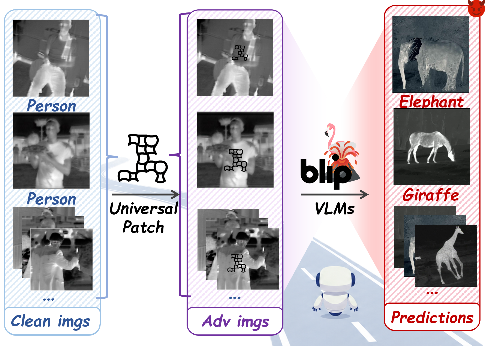

# UCGP: Universal Curved-Grid Patch for Infrared VLMs

Official research-code release for **Universal Curved-Grid Patch (UCGP)**, a universal physical adversarial patch framework for auditing semantic vulnerabilities in infrared vision-language models (IR-VLMs).

<p align="center">
  
</p>

<p align="center">
  <em>A single shared curved-grid patch is reused across infrared images to induce incorrect semantic predictions.</em>
</p>

UCGP learns one shared, deployable curved-grid patch and reuses it across images, target regions, and downstream tasks. The implementation follows the paper setting: Curved-Grid Mesh (CGM) parameterization, representation-level subspace/topology objective, local appearance regularization, and Meta Differential Evolution search.

This repository focuses on the patch optimization, checkpointing, rendering, and CLIP-style representation audit pipeline. The prompt-based captioning/VQA scoring pipeline used for paper evaluation is not included in this release.

## Highlights

- Curved-Grid Mesh patch parameterization for low-frequency deployable patterns.
- Representation-visible audit objective with subspace departure and topology disruption.
- Full-image infrared evaluation pipeline with detector-based target-region placement.
- MetaDE-style derivative-free optimization with checkpoint resume and theta export.
- Config-driven paper-style runs for OpenAI CLIP, OpenCLIP, Meta-CLIP, and EVA-CLIP variants.

## Repository Layout

```text
UCGP/
+-- assets/
|   +-- fig1_attack_overview.png
+-- configs/
|   +-- paper_default.yaml      # Paper-style fixed parameters
|   +-- smoke_test.yaml         # Tiny run for checking installation
+-- examples/
|   +-- run_paper_default.sh
|   +-- run_smoke.ps1
+-- tools/
|   +-- export_theta.py         # Export best theta from checkpoint
|   +-- render_theta.py         # Render exported theta as a mask image
+-- ucgp/
|   +-- backends/autoclip.py    # Hugging Face CLIP fallback backend
|   +-- cli.py                  # Config-driven command line entry
|   +-- config.py
|   +-- engine.py               # Core UCGP optimization engine
+-- CITATION.cff
+-- LICENSE
+-- pyproject.toml
+-- requirements.txt
+-- README.md
+-- SECURITY.md
```

## Installation

Create a fresh environment:

```bash
conda create -n ucgp python=3.10 -y
conda activate ucgp
pip install -r requirements.txt
pip install -e .
```

Install `mmdet/mmcv` according to your PyTorch and CUDA versions. The paper pipeline uses an MMDetection person detector to locate target regions before optimizing the patch.

If you use the original custom CLIP wrappers, place the directory containing `scripts/infer_clips.py` on `PYTHONPATH` or set:

```bash
export UCGP_LLAMA_FACTORY_ROOT=/path/to/LLaMA-Factory-or-your-wrapper-root
```

For standard Hugging Face CLIP checkpoints such as `openai/clip-vit-large-patch14`, the bundled fallback backend is sufficient.

## Data and Checkpoints

Prepare:

- Infrared images, e.g. Infrared-COCO, LSOTB-TIR, LLVIP, M3FD, or FLIR.
- An MMDetection detector config and checkpoint for person-region proposal.
- CLIP/IR-VLM visual encoder checkpoints.
- Optional fine-tuned CLIP checkpoints if reproducing your exact paper models.

Large datasets and weights are intentionally not included in this repository.

## Configuration

Edit `configs/paper_default.yaml`:

```yaml
detector:
  config: /path/to/mmdet/yolov3.py
  checkpoint: /path/to/yolov3_person_detector.pth

defaults:
  img_dir: /path/to/infrared/images
  output_root: ./outputs
  max_samples: 300
  G: 5
  pop_size: 50
  de_gens: 100
  lambda_topo: 0.12
  lambda_phys: 0.03
  eot_enabled: true
  tps_enabled: true
```

These defaults match the main paper setting as closely as possible from the local script: `G=5`, `max_samples=300`, `pop=50`, `gens=100`, black patch color, `roi_core_div=4.0`, `lambda_topo=0.12`, `lambda_budget=0.03`, and physical robustness transforms enabled. Following the AdvGrid-style pipeline, EOT samples random affine, photometric, and sensor-noise perturbations on the final adversarial image, while TPS applies a smooth thin-plate-spline deformation to the rendered perturbation mask before it is pasted into the target region. Set `eot_enabled: false` or `tps_enabled: false` for the corresponding ablation.

## Quick Check

First validate that the config resolves correctly:

```bash
python -m ucgp.cli --config configs/smoke_test.yaml --dry-run
```

or, after editable installation:

```bash
ucgp --config configs/smoke_test.yaml --dry-run
```

Then run the tiny smoke test after replacing paths:

```bash
python -m ucgp.cli --config configs/smoke_test.yaml
```

## Paper-Style Run

```bash
python -m ucgp.cli \
  --config configs/paper_default.yaml \
  --output-json outputs/paper_default_summary.json
```

Each run writes:

- `de_ckpt_latest.npz`: resumable optimization checkpoint.
- `exported_uap_theta_pack.npz`: compact exported patch parameters.
- `result_summary.json` and `result_summary.txt`: run-level metrics.
- `best_full_latest/`: latest saved clean/adversarial image snapshots when enabled.

Note: captioning and VQA evaluation in the paper can be reproduced with your own task prompts and judge scripts, but those prompt/scoring files are intentionally kept outside this repository.

## Export and Render Patch

Export from a checkpoint:

```bash
python tools/export_theta.py \
  --checkpoint outputs/openai_clip_vit_l_14/de_ckpt_latest.npz \
  --out-dir outputs/openai_clip_vit_l_14
```

Render the exported theta as a mask:

```bash
python tools/render_theta.py \
  --theta-pack outputs/openai_clip_vit_l_14/exported_uap_theta_pack.npz \
  --output outputs/openai_clip_vit_l_14/ucgp_mask.png
```

## Citation

```bibtex
@misc{hu2026ucgp,
  title={Revealing Physical-World Semantic Vulnerabilities: Universal Adversarial Patches for Infrared Vision-Language Models},
  author={Hu, Chengyin and Dong, Yuxian and Guo, Yikun and Chen, Xiang and Wu, Junqi and Long, Jiahuan and Wei, Yiwei and Jiang, Tingsong and Yao, Wen},
  year={2026},
  eprint={2604.03117},
  archivePrefix={arXiv},
  primaryClass={cs.CV},
  doi={10.48550/arXiv.2604.03117},
  url={https://arxiv.org/abs/2604.03117}
}
```

## Responsible Use

This code is released for robustness auditing and academic research on infrared multimodal systems. Do not use it to attack systems without authorization.
